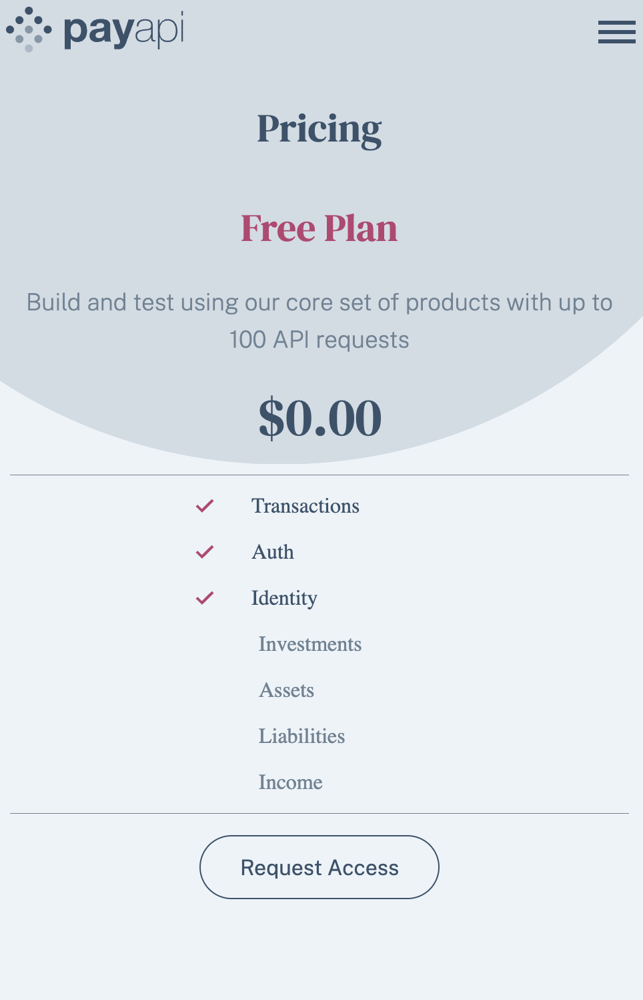
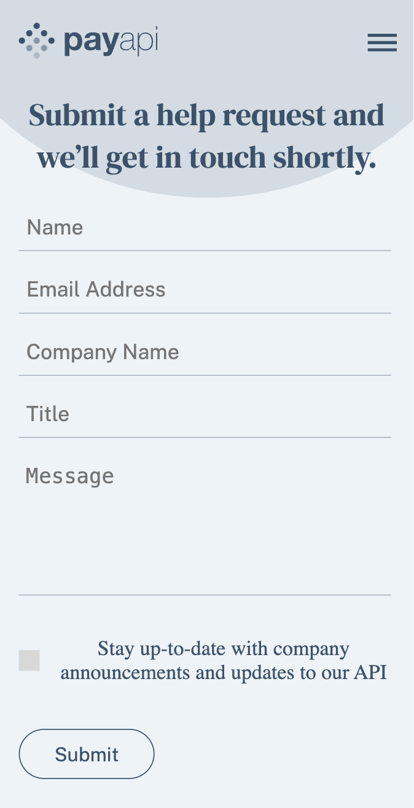

# PayAPI multi-page website solution
 Created a React based SPA (Single page application) with the help of React Router 6 and Layout Route for the fixed components.  

## Table of contents
- [Overview](#overview)
  - [Screenshot](#screenshot)
  - [Links](#links)
  - [Built with](#built-with)
  - [What I learned](#what-i-learned)

## Overview
The PayAPI web application has been a project to put my understanding of React Router 6, along with Layout Route into practice. I was able to use relative/absolute paths,reusable components, Link, NavLink and useLocation. 
I used useLocation for the reusable components to remove the error message from the email subscription when the user navigates to another page.
I used React state for controlled form input fields and error display. React useEffect hook to remove the form confirmation modal after few seconds.
The application has an input form for the email, and a contact form that displays an error message when the mandatory fields are not filled.

### Screenshot




### Links
- Github Link: https://github.com/Akshatasarawgi/PayAPI
- Live Site URL: 

### Built with
- [React](https://reactjs.org/) - JS library
- Semantic HTML5 markup
- CSS
- Flexbox
- CSS Grid
- Mobile-first workflow

### What I learned
I learned how to set a time out for the confirmation modal to disappear.

```
   React.useEffect(() => {
        if(showModal) {
            const timer = setTimeout(() => {
            setShowModal(false)
        }, 3000)
        return () => clearTimeout(timer)
        }
    }, [showModal])
```

I learned to remove the error message from a reusable component, by creating a dependency on the location of the url using useLocation from react router dom. 
```
        React.useEffect(() => {
            setError(false)
        },[location.pathname] )
```

I learned to handle scroll to the top manually when navigating between pages.
```
   useEffect(() => {
        window.scrollTo(0,0)
    },[pathname]);
```    